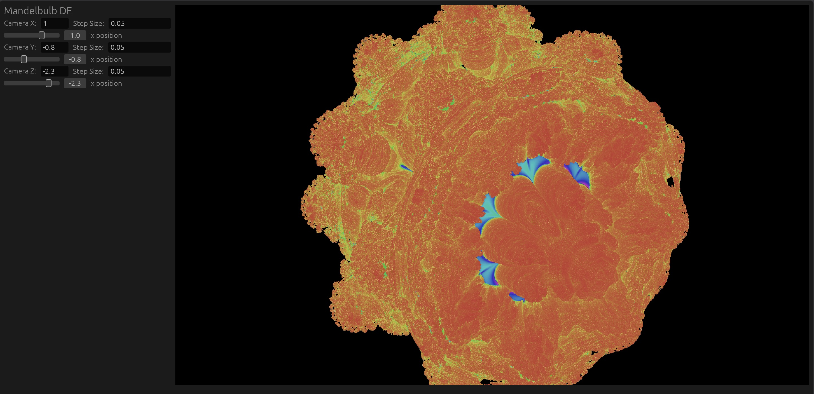

* Mandelbulb Web

This was meant to be a learning experiment to render a [[https://en.wikipedia.org/wiki/Mandelbulb][mandelbulb]]
fractal using distance estimation methods combined with ray marching
found [[http://blog.hvidtfeldts.net/index.php/2011/09/distance-estimated-3d-fractals-v-the-mandelbulb-different-de-approximations/][here]].

The first attempt was a [[src/reference.rs][reference]] implementation done on the cpu then
this was ported over to a [[src/shader.wgsl][wgsl shader]] to utilize the gpu in wgpu
within egui.

The only supported target is wasm which allows it to [[dist/index.html][run in the browser]].

To build from source:
#+begin_src bash
trunk serve --release
#+end_src

